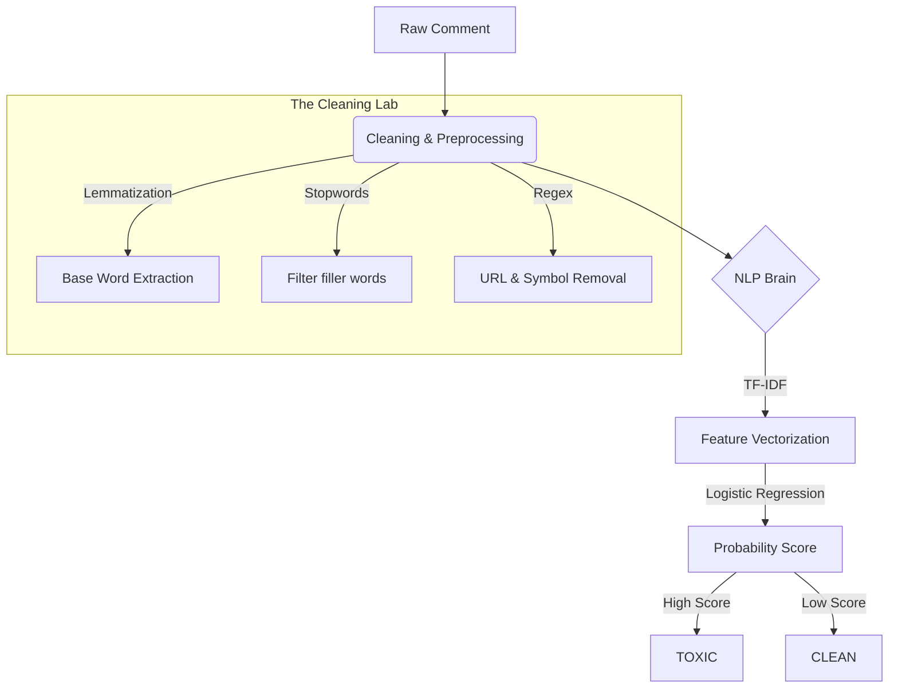

# YouTube Comment Toxicity Detector

In the digital age, comments shouldn't be a source of noise or negativity. **YouTube Comment Toxicity Detector** is a specialized tool designed to bring clarity and safety to digital conversations. Using machine learning, it screens for toxic language, threats, and insults, helping creators and moderators foster healthier communities.


---

## The Mission
The goal of this project isn't just to "filter words"—it's to understand **context**. By using advanced NLP techniques, we've built a system that recognizes the difference between casual conversation and harmful intent, providing a first line of defense against online toxicity.

- **Automated Moderation**: Fast, real-time screening for incoming comments.
- **Contextual Intelligence**: Beyond basic keywords; we analyze word frequency and significance.
- **User-Centric Design**: A sleek, dark-themed interface inspired by the YouTube ecosystem.

---

## How it Works: The NLP Pipeline
The detector doesn't just guess—it follows a rigorous scientific pipeline to ensure every prediction is backed by data.



---

## Feature Highlights
- **Multi-Label Insights**: Detects not just general toxicity, but specific categories like insults, threats, and abuse.
- **TF-IDF Vectorization**: Uses statistical weights to identify which words carry the most "toxic" importance in a sentence.
- **Flask-Powered Inference**: A lightweight, high-performance web server ensures instant predictions.
- **Robust Cleaning**: Integrated **NLTK** pipeline for professional-grade text lemmatization and cleaning.

---

## Technology Stack
- **Engine**: Python, Scikit-learn (Logistic Regression)
- **Intelligence**: NLTK (Natural Language Toolkit)
- **Vectorization**: TF-IDF (Term Frequency-Inverse Document Frequency)
- **Interface**: Flask, HTML5, CSS3 (Modern Dark Theme)
- **Model Storage**: Pickle (Serialized for performance)

---

## Quick Start

### Prerequisites
- Python 3.8+
- `pip install flask pandas scikit-learn nltk`

### Installation
1. **Clone the repository**
   ```bash
   git clone https://github.com/Akkii88/Youtube-Comment-Toxicity-Detector.git
   cd Youtube-Comment-Toxicity-Detector
   ```

2. **Set up NLTK data**
   ```python
   import nltk
   nltk.download('stopwords')
   nltk.download('wordnet')
   ```

3. **Run the Application**
   ```bash
   python app.py
   ```
   *Navigate to `http://127.0.0.1:5000` to start screening.*

---

## A Commitment to Ethics
Toxicity detection is a sensitive field. This tool is designed to assist humans, not replace them. We believe in **transparent moderation**, where AI handles the heavy lifting of screening, allowing human community managers to make the final, nuanced decisions.

---
*Created to help make the internet a little warmer, one comment at a time.*
